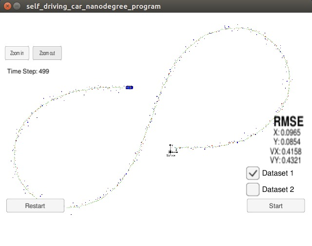
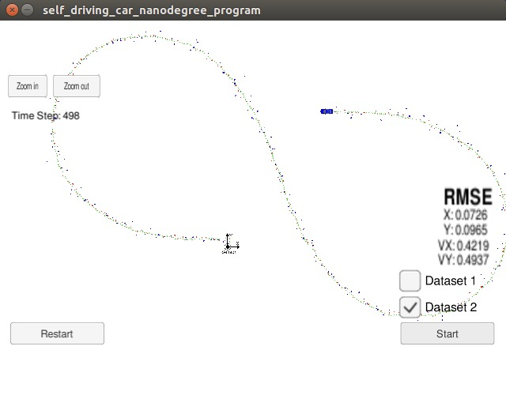

# Extended-Kalman-Filter

## Project Basics

In this project, I used C++ to write a program taking in radar and lidar data to track position using Extended Kalman 
Filters.

The code will make a prediction based on the sensor measurement and then update the expected position. See files in the 
'src' folder for the primary C++ files making up this project.

## Build instructions

Assuming you have 'cmake' and 'make' already:

* Clone this repo.
* Make a build directory: mkdir build && cd build
* Compile: cmake .. && make
* Run it: ./ExtendedKF

## Sensor Fusion General Processing Flow

## Datas and Results

The simulator provides two datasets. The difference between them are:

    The direction the car (the object) is moving.
    The order the first measurement is sent to the EKF. On dataset 1, the LIDAR measurement is sent first. 
    On the dataset 2, the RADAR measurement is sent first.
    
In two different simulated runs, my Extended Kalman Filter produces the below results in the form of [px, py, vx, vy]. The x-position is shown as 'px', 
y-position as 'py', velocity in the x-direction is 'vx', while velocity in the y-direction is 'vy'.Residual error is 
calculated by mean squared error (MSE).

The EKF accuracy was:

    Dataset 1 : RMSE <= [0.0973, 0.0855, 0.4513, 0.4399]
    Dataset 2 : RMSE <= [0.0726, 0.0965, 0.4216, 0.4932]

  

    

